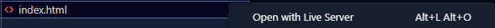

# Front-end Puc-Rio MVP

O objetivo desse README é mostrar a inicialização do front e instalação de algumas dependências/bibliotecas.

---
## Como inicializar

Primeiramente usar o comando `npm install` para instalar quaisquer dependências que estarão no `package.json`

```
npm install
```

---
Em seguida fazer o download do "Live Server" nas extensões, clicar com o botão direto do mouse em "index.html"
e clicar em "Open with Live Server" como mostrado nas seguintes imagens.


